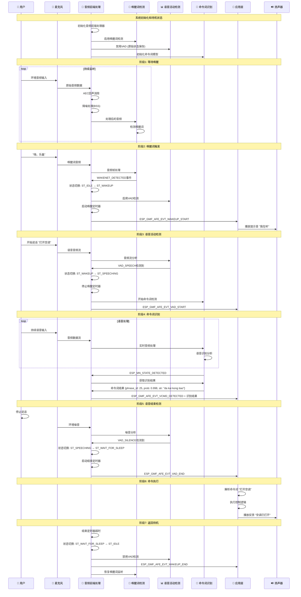
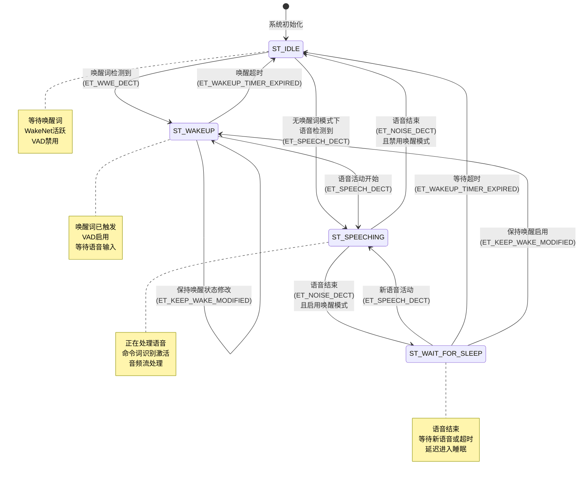
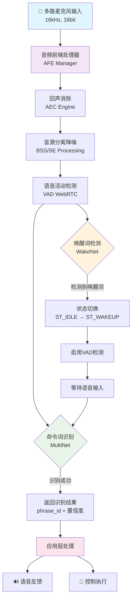
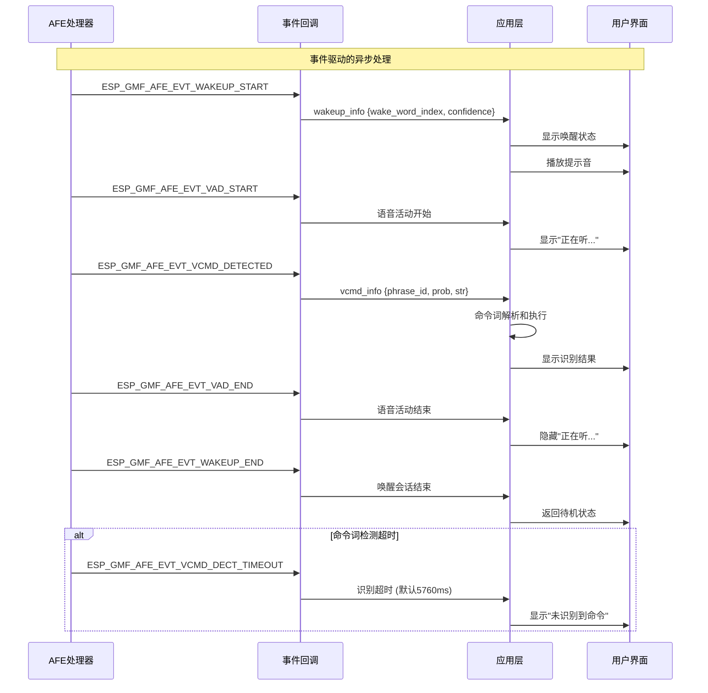
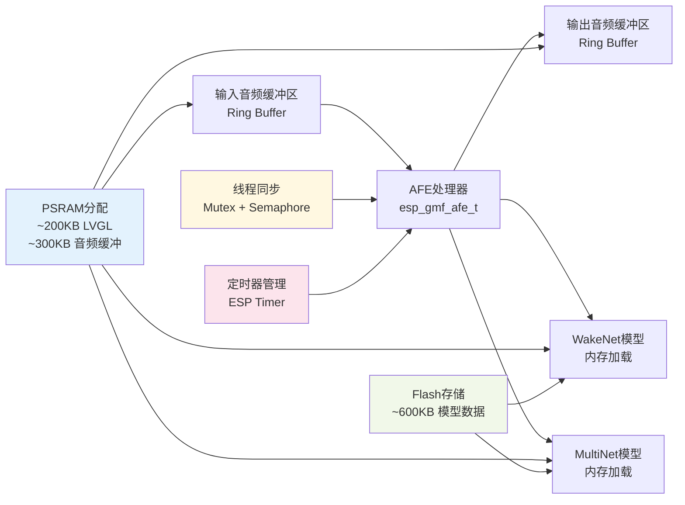

# 智能音箱AI语音功能时序图

## 系统架构概述

基于ESP-SR组件的语音识别系统，包含音频前端处理(AFE)、唤醒词检测(WakeNet)、语音活动检测(VAD)和命令词识别(MultiNet)。

## 主要时序图

### 1. 完整语音交互流程

### 2. 状态机转换详图

### 3. 音频处理管道详图

### 4. 事件回调机制

### 5. 内存管理和数据流

## 关键技术参数

### 音频参数
- **采样率**: 16kHz
- **位深度**: 16bit
- **通道数**: 2个麦克风 + 1个回放通道
- **数据块大小**: 2048字节 (默认)

### 算法配置
- **唤醒词模型**: WakeNet v9 (wn9_hilexin)
- **命令词模型**: MultiNet v6 (mn6_cn) 
- **VAD算法**: WebRTC VAD
- **降噪算法**: 盲源分离 (BSS)

### 超时设置
- **唤醒超时**: 可配置 (默认根据应用设定)
- **命令词超时**: 5760ms (5.76秒)
- **等待睡眠**: 可配置延时

### 内存占用
- **PSRAM使用**: ~500KB (音频缓冲 + LVGL)
- **Flash模型**: ~600KB (语音识别模型)
- **运行内存**: ~50KB (状态管理 + 线程栈)

## 典型使用场景

1. **标准唤醒模式**: "嗨乐鑫" → "打开空调" → 执行命令
2. **连续对话模式**: 保持唤醒状态，无需重复唤醒词
3. **直接命令模式**: 禁用唤醒词，直接语音命令识别
4. **超时处理**: 唤醒后无语音输入或识别超时的处理

这个时序图展示了ESP-SR在智能音箱中的完整工作流程，从音频采集到最终的命令执行，包括所有的状态转换和事件处理机制。
