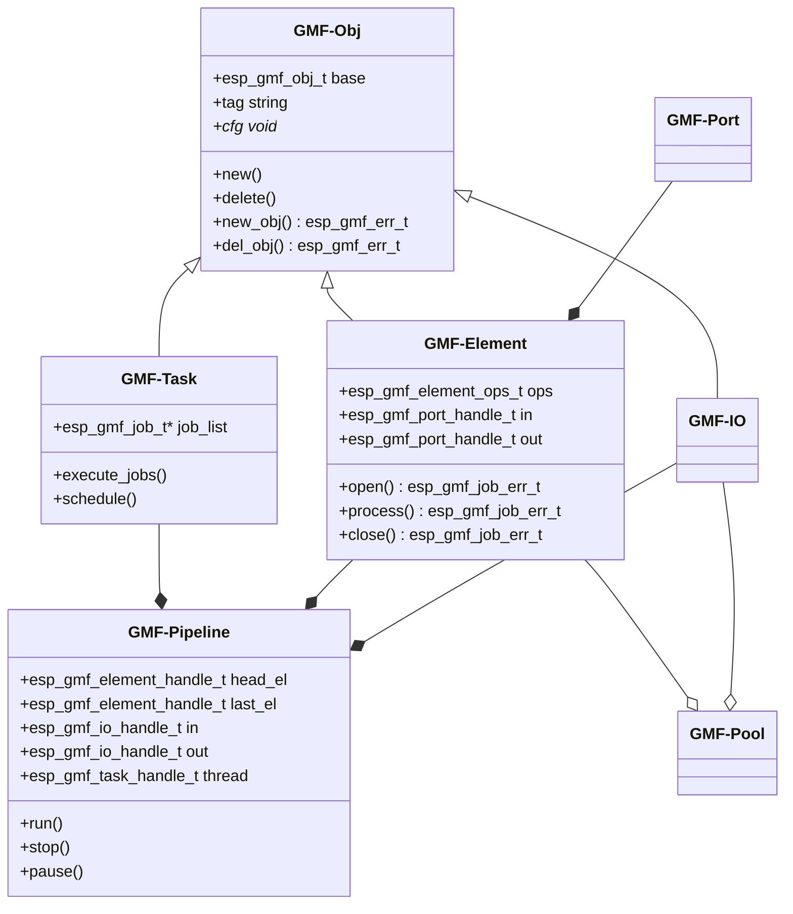
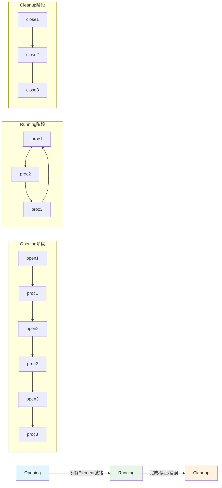
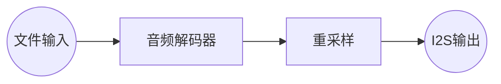
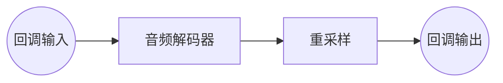
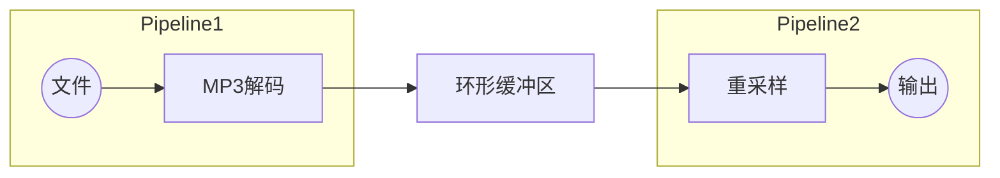
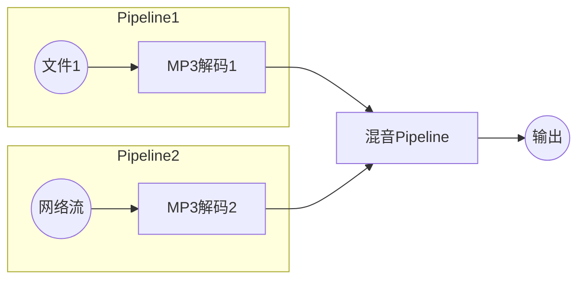
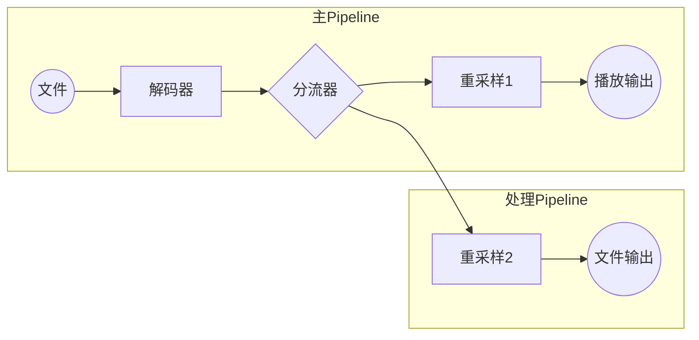
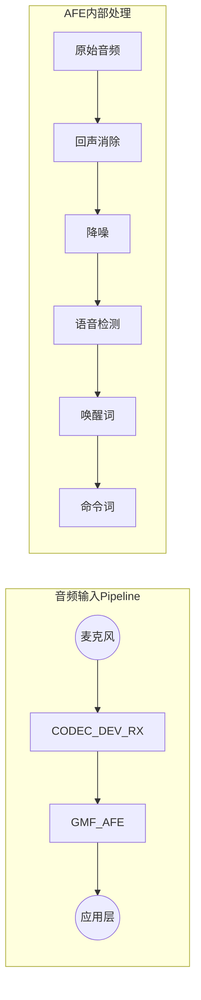

# GMF (Generic Media Framework) 组件分析

## 概述

GMF (Generic Media Framework) 是乐鑫开发的通用媒体处理框架，专为ESP32系列芯片设计的高性能、模块化的媒体处理系统。它为音频、视频和图像处理提供统一的编程接口和流水线架构。

## 核心架构

### 1. 整体架构图



### 2. 核心组件详解

#### **GMF-Obj (基础对象类)**
- **作用**: 所有GMF组件的基类，提供统一的对象管理接口
- **功能**: 对象创建、销毁、复制、配置管理
- **结构体**:
```c
typedef struct esp_gmf_obj_ {
    struct esp_gmf_obj_ *prev;
    struct esp_gmf_obj_ *next;
    esp_gmf_err_t (*new_obj)(void *cfg, esp_gmf_obj_handle_t *new_obj);
    esp_gmf_err_t (*del_obj)(esp_gmf_obj_handle_t obj);
    const char *tag;
    void *cfg;
} esp_gmf_obj_t;
```

#### **GMF-Element (处理元素)**
- **作用**: 媒体处理的基本单元，实现具体的处理功能
- **类型**: 
  - Audio Element: 编解码器、EQ、混音器、重采样等
  - Picture Element: JPEG编解码器、PNG解码器等
  - Video Element: 视频处理元素
- **核心操作**:
  - `open()`: 元素初始化
  - `process()`: 数据处理
  - `close()`: 资源清理

#### **GMF-Pipeline (处理流水线)**
- **作用**: 管理和连接多个Element，形成完整的处理链
- **功能**: 
  - Element连接管理
  - 任务调度控制
  - 事件处理
  - 状态管理

#### **GMF-Task (任务执行器)**
- **作用**: 执行Job的线程，处理Element的工作任务
- **工作模式**: 
  - Opening阶段: 执行所有Element的open和首次process
  - Running阶段: 循环执行Element的process
  - Cleanup阶段: 执行所有Element的close

## 工作原理

### 1. Job驱动模型



### 2. Job执行机制

```c
typedef enum {
    ESP_GMF_JOB_TIMES_NONE     = 0,  // 不执行
    ESP_GMF_JOB_TIMES_ONCE     = 1,  // 执行一次
    ESP_GMF_JOB_TIMES_INFINITE = 2   // 无限执行
} esp_gmf_job_times_t;

typedef enum {
    ESP_GMF_JOB_ERR_TRUNCATE = 3,    // 任务被截断
    ESP_GMF_JOB_ERR_DONE     = 2,    // 任务完成
    ESP_GMF_JOB_ERR_CONTINUE = 1,    // 任务继续
    ESP_GMF_JOB_ERR_OK       = 0,    // 任务成功
    ESP_GMF_JOB_ERR_FAIL     = -1    // 任务失败
} esp_gmf_job_err_t;
```

### 3. 数据流管理

#### **GMF-DataBus**
- **功能**: 数据传输和缓冲管理
- **传输方式**:
  - 零拷贝传输 (PBuffer, FIFO, BlockBuffer)
  - 拷贝传输 (Ringbuffer)
- **访问模式**:
  - 阻塞访问
  - 非阻塞访问
- **操作模式**: Acquire → Process → Release

#### **GMF-Port**
- **作用**: Element之间的数据接口
- **功能**: 
  - Payload缓冲区管理
  - 连接能力管理
  - 数据传递控制

## 应用场景

### 1. 基础Pipeline应用

#### **场景1: 文件播放**


#### **场景2: 回调处理**


#### **场景3: 分离式Pipeline**


### 2. 复杂应用场景

#### **多路混音**


#### **数据分流**


## 在您项目中的应用

### 1. AI语音处理Pipeline



### 2. 与ESP-SR的集成

在您的智能音箱项目中，GMF框架与ESP-SR的集成体现在：

```c
// esp_gmf_afe.c 中的关键实现
typedef struct {
    esp_gmf_audio_element_t parent;      // 继承GMF Audio Element
    esp_gmf_db_handle_t     in_db;       // 输入数据总线
    esp_gmf_db_handle_t     out_db;      // 输出数据总线
    esp_mn_iface_t         *multinet;    // ESP-SR MultiNet接口
    model_iface_data_t     *mn_handle;   // ESP-SR模型句柄
} esp_gmf_afe_t;

// Element操作实现
static esp_gmf_job_err_t esp_gmf_afe_open(esp_gmf_audio_element_handle_t self, void *para)
{
    // 初始化AFE管理器
    // 设置音频参数
    // 创建唤醒定时器
    // 初始化ESP-SR模型
}

static esp_gmf_job_err_t esp_gmf_afe_proc(esp_gmf_audio_element_handle_t self, void *para)
{
    // 从输入Port获取音频数据
    // 写入AFE输入数据总线
    // 从AFE输出数据总线读取处理结果
    // 输出到下一个Element
}
```

## GMF框架优势

### 1. **模块化设计**
- Element独立开发和测试
- 灵活的Pipeline组合
- 标准化接口

### 2. **高性能**
- 零拷贝数据传输
- 基于Job的任务调度
- 内存优化设计

### 3. **可扩展性**
- 支持自定义Element
- Pipeline级联
- 事件驱动架构

### 4. **资源管理**
- 自动的生命周期管理
- 统一的错误处理
- 内存池管理

## 与传统架构对比

### 传统方案
```c
// 传统的串行处理
audio_data = read_from_mic();
processed_data = aec_process(audio_data);
processed_data = noise_reduction(processed_data);
result = voice_recognition(processed_data);
```

### GMF方案
```c
// GMF Pipeline处理
esp_gmf_pipeline_create(&pipeline);
esp_gmf_pipeline_register_element(pipeline, codec_element);
esp_gmf_pipeline_register_element(pipeline, afe_element);
esp_gmf_pipeline_register_element(pipeline, output_element);
esp_gmf_pipeline_run(pipeline);
```

## 性能特点

### 内存使用
- **零拷贝传输**: 减少内存拷贝开销
- **缓冲区复用**: 智能的缓冲区管理
- **按需分配**: 动态内存管理

### 并发处理
- **Pipeline并行**: 多个Pipeline可并行运行
- **Element异步**: Element间异步数据传递
- **任务调度**: 高效的Job调度机制

### 实时性
- **低延迟**: 优化的数据传输路径
- **实时调度**: 基于优先级的任务调度
- **流式处理**: 支持实时数据流处理

GMF框架为您的智能音箱项目提供了强大而灵活的媒体处理能力，特别是在音频处理和语音识别方面，与ESP-SR的完美集成使得整个系统具有高性能、低延迟和优秀的可维护性。
