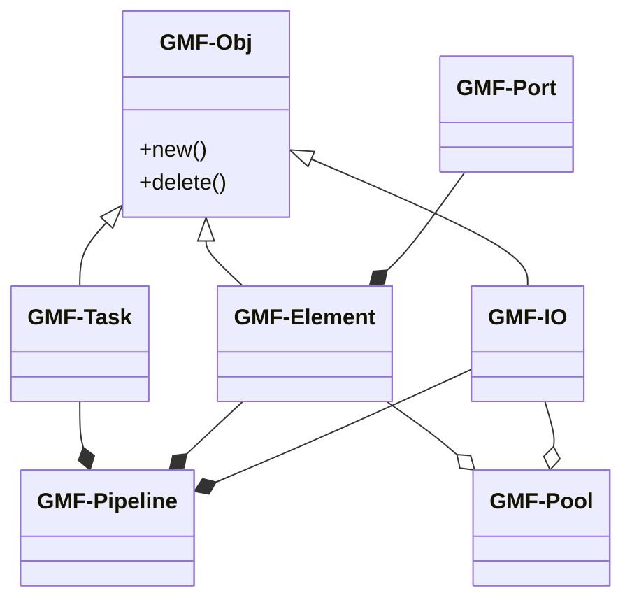
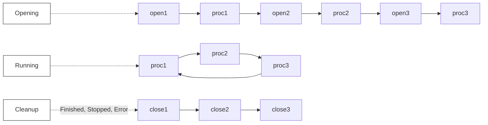
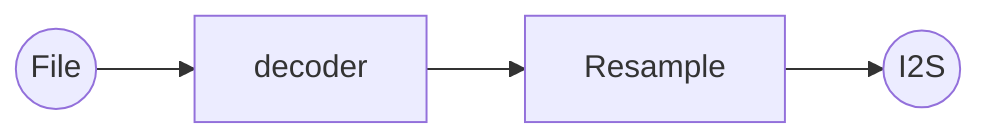
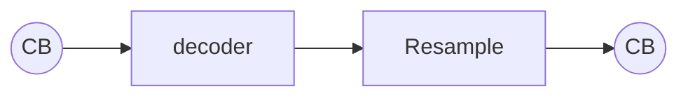
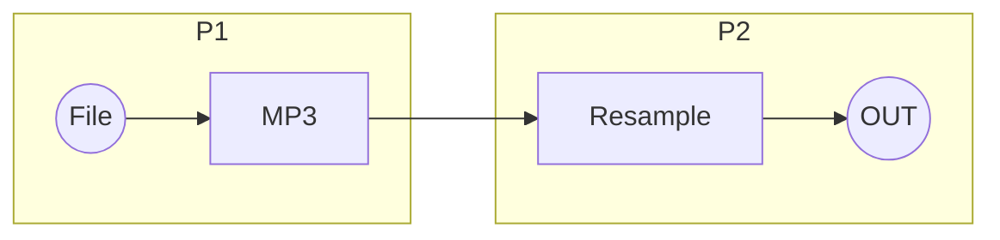
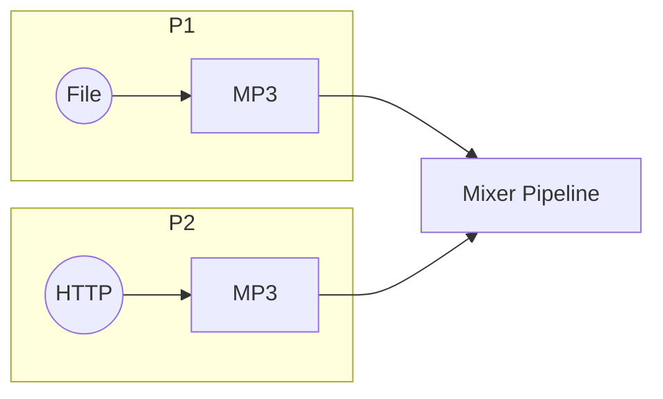
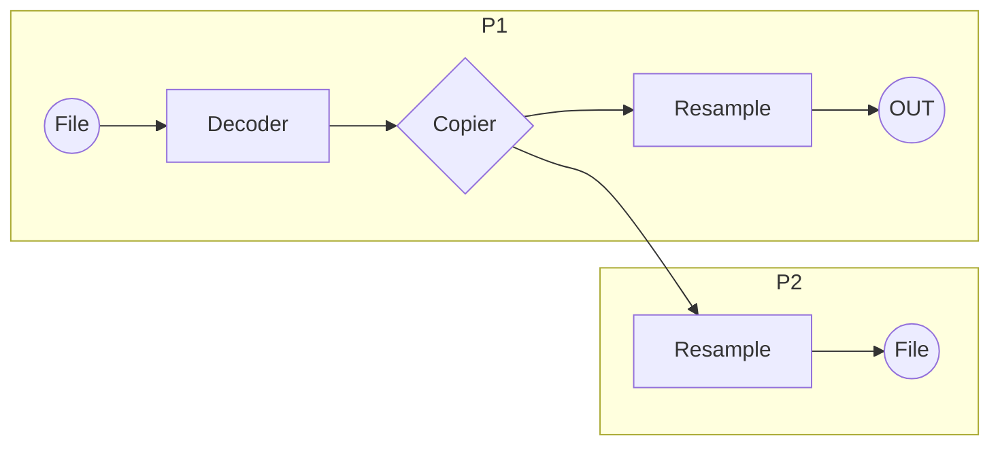
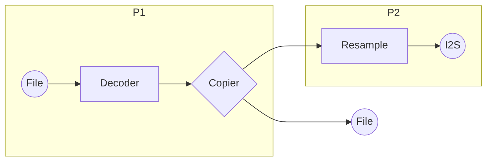
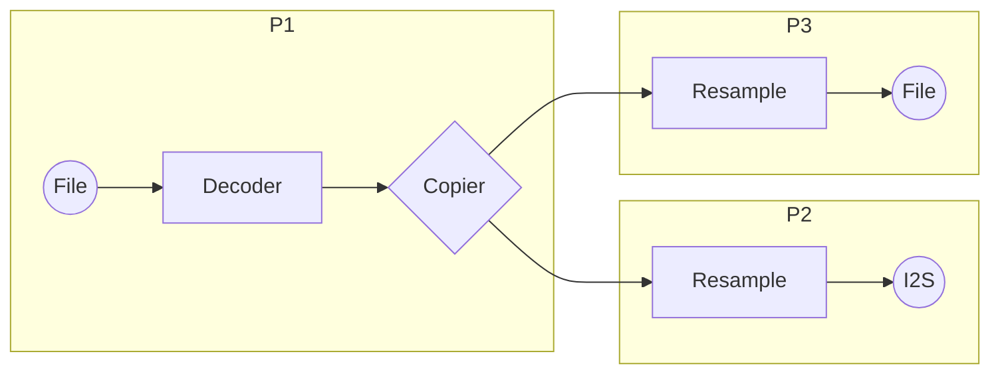

# GMF-Core 框架概览
[English](./README.md)

下面的类图展示了 GMF-Core 框架中的主要类关系：

`GMF-Obj` 是核心类，提供统一的对象创建和销毁接口，以便于管理派生类对象。`GMF-IO`、`GMF-Task` 和 `GMF-Element` 都继承自它。

GMF-Core 主要由 `GMF-Element`、`GMF-Pipeline` 和 `GMF-Task` 组成。它围绕一个称为 "job" 的单元操作，该单元作为最小的处理单元。每个 job 都是实时加载和执行的。
- **GMF-Element** 是 job 提供者，提供三个基本的 job：open、process 和 close。通常，open 是第一个加载的 job，process 在 open 完成后紧接着执行，当所有 job 完成或发生错误时，close job 被加载。
- **GMF-Pipeline** 管理和加载连接元素的 job，控制 `GMF-Task` 的开始和停止，以及打开和关闭 IN 和 OUT IO 接口（如果有的话）。
- **GMF-Task** 处理 job 的工作流，如下所示。任务分为三个阶段：**opening**（调用每个元素的 open 和 process job 一次）、**running**（根据连接顺序重复调用每个元素的 process job）、**cleanup**（当 job 完成或发生错误时，调用 close job 以释放资源）。

## GMF-Pool
`GMF-Pool` 是 `GMF-Element` 和 `GMF-IO` 的管理单元。它使得基于字符串列表创建管道成为可能，首先创建对象副本，然后连接它们以形成管道。如果新的管道需要特定的元素或 IO 配置更改，可以在管道创建后使用 `esp_gmf_pipeline_get_el_by_name` 和 `OBJ_GET_CFG` 进行调整。

## GMF-Element
`GMF-Element` 是一个基类，旨在实现特定的功能元素。其派生类别包括音频元素、图片元素等。

- 一个 **音频元素** 类可能包括编码器、解码器以及音频处理算法，如均衡器、混音器和重采样器。
- 一个 **图片元素** 类可能包括 JPEG 编码器/解码器、PNG 解码器等。

GMF-Element 的输入和输出端口由 GMF-Port 表示。GMF-Port 根据元素的连接状态和请求的数据大小管理有效载荷缓冲区，促进元素之间有效载荷数据的传输。GMF-Element 负责管理 GMF-Port 的连接能力和连接数量。

## GMF-DataBus
`GMF-DataBus` 是 GMF-Core 的数据访问模块，采用获取-释放方法进行数据访问。`GMF-DataBus` 支持零拷贝和基于拷贝的数据传输，以及阻塞和非阻塞访问模式。目前，GMF-Core 支持四种缓冲区类型：`Ringbuffer`、`PBuffer`、`FIFO` 和 `BlockBuffer`。`PBuffer`、`FIFO` 和 `BlockBuffer` 使用零拷贝传输，而 `Ringbuffer`、`FIFO` 和 `BlockBuffer` 提供阻塞接口。

## GMF-Task
`GMF-Task` 是执行 job 的线程，从一个列表中获取 job 并串行运行它们。一旦列表中的所有 job 都被处理，它就进入空闲状态，直到添加新 job。Job 是最小的工作单位，分为一次性 job 和连续性 job。

## GMF-Pipeline
一个 `GMF-Pipeline` 由元素、任务和 IO 组成。每个管道至少需要一个任务来管理和调度 job。`GMF-Pipeline` 支持顺序级联管道，允许一个管道连接到另一个管道并级联事件。

该管道还支持具有事件依赖关系的元素的有序启动。例如，如果一个管道由解码器和重采样器组成，而重采样器需要解码器解析的音乐数据，则 `GMF-Pipeline` 将首先仅启动解码器。解码器解析完数据后，管道将启动重采样器。这个流程简化了操作，避免了不必要的噪音。

`GMF-Pipeline` 是 GMF 中一个独立操作的模块，为用户提供管道操作的控制接口，如运行、停止、暂停、恢复和重置。`GMF-Pipeline` 管理与之连接的元素和任务，以及 IN 和 OUT 端口的打开和关闭。在操作过程中，管道注册并管理连接元素的 job。一个典型的 `GMF-Pipeline` 包含一个 GMF-Task、至少一个元素、最多一个 IN 端口和最多一个 OUT 端口。IN 端口连接到第一个元素的输入，OUT 端口连接到最后一个元素的输出。一个管道可以包含一个或多个元素，元素的数量没有限制，仅受物理资源可用性的限制。

以下是四个基本的管道应用示例。

**应用示例 1：** 单个管道从文件解码音频并通过 I2S 播放。

**应用示例 2：** 管道的输入和输出端口被回调函数替换，以获取用户提供的数据。

**应用示例 3：** 单个播放管道被拆分为两个，通过 `Ringbuffer` 连接。

**应用示例 4：** 两个管道合并为一个混音器管道以进行多通道混音。

复杂的管道在数据分发场景中非常有价值，例如在播放音乐时为声学回声消除 (AEC) 提供音频数据作为参考。以下示例使用具有多输出能力的 `copier` 元素，实现与多个管道或输出的连接。

**应用示例 1：** 使用两个管道从单个输入源实现多输出。解码的数据通过 copier 转发到附加管道。

**应用示例 2：** 使用两个管道从单个输入源实现多输出。一个输出通过管道传递，另一个通过端口传递。

**应用示例 3：** 使用三个管道从单个输入源实现多输出。解码的数据通过 `ringbuffer` 分发到每个后续管道。

## 使用说明

有关 GMF-Core API 的简单示例，请参阅 [test_apps](./test_apps/main/cases/gmf_pool_test.c)。有关其他实际应用示例，请查看 GMF-Elements 中提供的示例。
