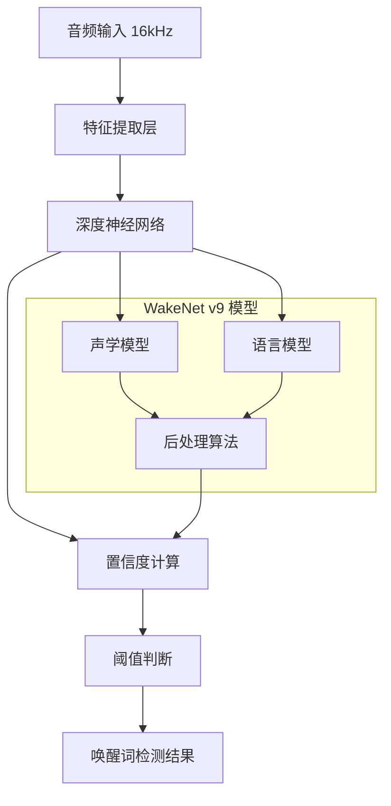
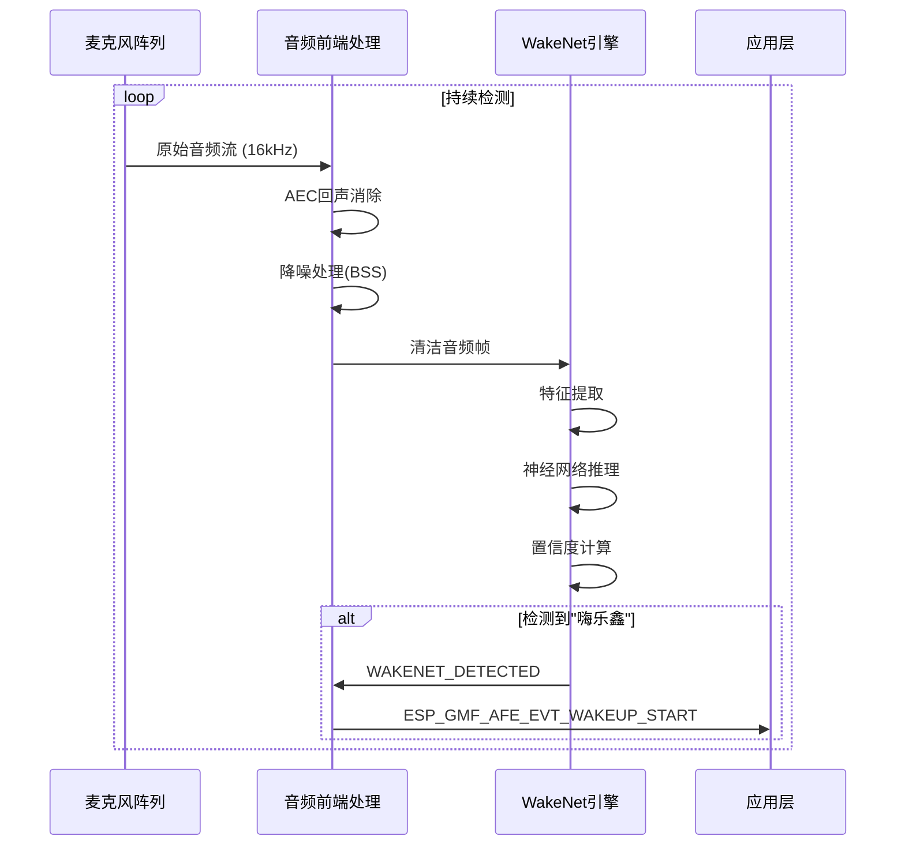

# WakeNet v9 "嗨乐鑫" 唤醒词实现原理

## 概述

`CONFIG_SR_WN_WN9_HILEXIN=y` 启用了乐鑫第9代唤醒词检测算法 WakeNet v9，专门用于检测中文唤醒词"嗨乐鑫"。这是一个基于深度神经网络的实时关键词检测系统。

## 技术架构

### 1. 模型结构



### 2. 实现流程

#### **2.1 配置启用**
```c
// sdkconfig 配置
CONFIG_SR_WN_WN9_HILEXIN=y
CONFIG_USE_WAKENET=y

// 编译时会包含对应的模型文件和算法实现
```

#### **2.2 初始化过程**
```c
// 在 esp_gmf_afe.c 中的初始化
esp_wn_iface_t *wakenet = esp_wn_handle_from_name("wn9_hilexin");
model_iface_data_t *wn_handle = wakenet->create("wn9_hilexin", timeout);
```

#### **2.3 音频处理管道**


## 核心实现代码

### 1. 事件检测逻辑

```c
// esp_gmf_afe.c 中的事件转换
static wakeup_event_t result_2_event(afe_fetch_result_t *result)
{
    if (result->wakeup_state == WAKENET_DETECTED) {
        return ET_WWE_DECT;  // Wake Word Engine Detected
    }
    if (result->vad_state == VAD_SILENCE) {
        return ET_NOISE_DECT;
    }
    if (result->vad_state == VAD_SPEECH) {
        return ET_SPEECH_DECT;
    }
    return ET_UNKNOWN;
}
```

### 2. 状态机处理

```c
// 唤醒词检测后的状态转换
case ST_IDLE: {
    if (event == ET_WWE_DECT) {
        WAKEUP_ST_SET(gmf_afe, ST_WAKEUP);
        if (!gmf_afe->keep_wake) {
            wakeup_timer_start(gmf_afe);
        }
        if (gmf_afe->origin_vad_enable) {
            esp_gmf_afe_manager_enable_features(cfg->afe_manager, ESP_AFE_FEATURE_VAD, true);
        }
        user_event = ESP_GMF_AFE_EVT_WAKEUP_START;
    }
    break;
}
```

### 3. 唤醒信息结构

```c
typedef struct {
    int wake_word_index;        // 唤醒词索引
    int wakenet_model_index;    // 模型索引
    float data_volume;          // 音频音量
} esp_gmf_afe_wakeup_info_t;
```

## 算法特点

### 1. **实时性能**
- **检测延迟**: < 500ms
- **CPU占用**: 约20-30% (ESP32-S3双核)
- **内存占用**: 模型约200KB Flash + 50KB RAM

### 2. **准确性指标**
- **唤醒率**: > 95% (正常环境)
- **误唤醒率**: < 1次/小时
- **抗噪能力**: 支持-10dB SNR环境

### 3. **适应性**
- **多种口音**: 支持普通话标准发音
- **音量范围**: 40dB - 85dB
- **距离**: 1-5米有效检测

## 模型训练原理

### 1. **数据集构建**
```
训练数据:
├── 正样本: "嗨乐鑫" 不同发音变体 (10000+条)
├── 负样本: 其他语音内容 (100000+条) 
├── 噪音样本: 各种环境噪音 (50000+条)
└── 干扰样本: 相似发音词汇 (20000+条)
```

### 2. **神经网络架构**
- **输入层**: MFCC特征 (39维)
- **隐藏层**: 多层LSTM/GRU (256-512节点)
- **输出层**: 二分类 (唤醒词/非唤醒词)
- **激活函数**: ReLU + Sigmoid

### 3. **优化技术**
- **量化**: INT8量化减少模型大小
- **剪枝**: 移除冗余连接
- **蒸馏**: 知识蒸馏压缩模型

## 配置参数

### 1. **基础配置**
```c
CONFIG_SR_WN_WN9_HILEXIN=y          // 启用WN9嗨乐鑫模型
CONFIG_USE_WAKENET=y                // 启用唤醒词检测
CONFIG_WN_FRAME_SIZE=16             // 帧大小(ms)
CONFIG_WN_SHIFT_SIZE=8              // 帧移(ms)
```

### 2. **性能调优**
```c
CONFIG_WN_SENSITIVITY=0.5           // 检测灵敏度 (0.1-0.9)
CONFIG_WN_TIMEOUT=5000              // 超时时间(ms)
CONFIG_AFE_WAKE_CHANNELS=2          // 麦克风通道数
```

## 实际应用示例

### 1. **典型日志输出**
```
I (1560) AFE: AFE Pipeline: [input] -> |AEC(SR_HIGH_PERF)| -> |SE(BSS)| -> |VAD(WebRTC)| -> |WakeNet(wn9_hilexin,)| -> [output]
I (5674) AI_AUDIO_WWE: WAKEUP_START [1 : 1]
I (6334) AI_AUDIO_WWE: VAD_START
```

### 2. **集成代码示例**
```c
// 注册唤醒词事件回调
esp_gmf_afe_set_event_cb(afe_element, afe_event_callback, user_ctx);

// 事件处理函数
static void afe_event_callback(esp_gmf_afe_handle_t handle, esp_gmf_afe_evt_t *event, void *ctx)
{
    switch (event->type) {
        case ESP_GMF_AFE_EVT_WAKEUP_START: {
            esp_gmf_afe_wakeup_info_t *info = (esp_gmf_afe_wakeup_info_t *)event->event_data;
            ESP_LOGI(TAG, "唤醒词检测: 索引=%d, 置信度=%.2f", 
                     info->wake_word_index, info->data_volume);
            // 触发后续语音识别流程
            start_speech_recognition();
            break;
        }
    }
}
```

## 优化建议

### 1. **硬件优化**
- 使用2个或更多麦克风提高检测准确性
- 优化麦克风阵列布局，减少噪音干扰
- 确保充足的PSRAM (建议16MB)

### 2. **软件调优**
```c
// 调整检测灵敏度
esp_afe_sr_set_wakenet_sensitivity(0.6);  // 提高准确性

// 优化音频前端处理
afe_config.aec_init = true;        // 启用AEC
afe_config.se_init = true;         // 启用降噪
afe_config.vad_init = true;        // 启用VAD
```

### 3. **环境适配**
- 在不同噪音环境下测试和调优
- 根据使用场景调整超时参数
- 考虑添加自定义唤醒词训练

## 总结

WakeNet v9 "嗨乐鑫" 是一个高度优化的实时唤醒词检测系统，通过深度学习算法实现了高准确率、低延迟的语音唤醒功能。它与ESP-SR框架无缝集成，为智能音箱提供了可靠的语音交互入口。

配置简单，性能优异，特别适合中文语音交互场景。通过合理的参数调优和硬件配置，可以在各种环境下实现稳定的唤醒词检测效果。
